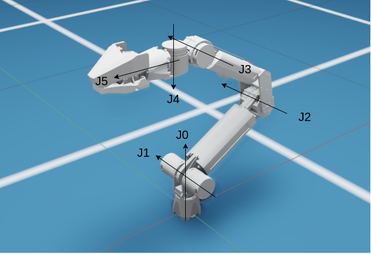
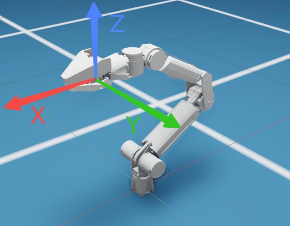
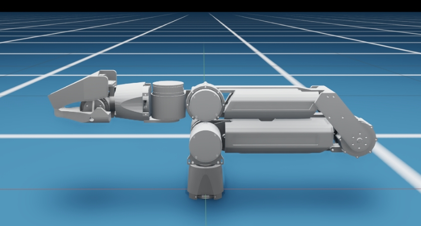

2. Using the SDK
================

Users only need to understand the contents of these two folders: \*
**include**: This folder contains the header files of the arx5_sdk, and
users can view the annotations to understand the functions. \*
**examples**: This folder contains usage examples of the robotic arm
SDK.

The examples folder contains multiple examples for users to learn and
use.

2.1 Teaching
------------

TODO

2.2 Keyboard Control
--------------------

2.2.1 Joint Space Control
~~~~~~~~~~~~~~~~~~~~~~~~~

.. code:: sh

   cd libarx5/build
   ./jointKeyboardControl #TODO

In joint space control, the position of the robotic arm joints can be
controlled by pressing and holding the keyboard keys. It should be noted
that all robotic arm joints are in the right-handed coordinate system.

.. raw:: html

   <table border="1">

.. raw:: html

   <tr>

.. raw:: html

   <td>

Joint ID

.. raw:: html

   </td>

.. raw:: html

   <td>

0

.. raw:: html

   </td>

.. raw:: html

   <td>

1

.. raw:: html

   </td>

.. raw:: html

   <td>

2

.. raw:: html

   </td>

.. raw:: html

   <td>

3

.. raw:: html

   </td>

.. raw:: html

   <td>

4

.. raw:: html

   </td>

.. raw:: html

   <td>

5

.. raw:: html

   </td>

.. raw:: html

   </tr>

.. raw:: html

   <tr>

.. raw:: html

   <td>

Keyboard Key

.. raw:: html

   </td>

.. raw:: html

   <td>

Q/A

.. raw:: html

   </td>

.. raw:: html

   <td>

W/S

.. raw:: html

   </td>

.. raw:: html

   <td>

E/D

.. raw:: html

   </td>

.. raw:: html

   <td>

R/F

.. raw:: html

   </td>

.. raw:: html

   <td>

T/G

.. raw:: html

   </td>

.. raw:: html

   <td>

Y/H

.. raw:: html

   </td>

.. raw:: html

   </tr>

.. raw:: html

   <tr>

.. raw:: html

   <td>

Control Effect

.. raw:: html

   </td>

.. raw:: html

   <td>

CW / CCW

.. raw:: html

   </td>

.. raw:: html

   <td>

CW / CCW

.. raw:: html

   </td>

.. raw:: html

   <td>

CW / CCW

.. raw:: html

   </td>

.. raw:: html

   <td>

CW / CCW

.. raw:: html

   </td>

.. raw:: html

   <td>

CW / CCW

.. raw:: html

   </td>

.. raw:: html

   <td>

CW / CCW

.. raw:: html

   </td>

.. raw:: html

   </tr>

.. raw:: html

   </table>

2.2.2 Cartesian Space Control
~~~~~~~~~~~~~~~~~~~~~~~~~~~~~

.. code:: sh

   cd libarx5/build
   ./cartesianKeyboardControl # TODO

In Cartesian space control, the position of the robotic arm end effector
can be controlled by pressing and holding the keyboard keys.

.. raw:: html

   <table border="1">

.. raw:: html

   <tr>

.. raw:: html

   <td>

Keyboard Key

.. raw:: html

   </td>

.. raw:: html

   <td>

Q/A

.. raw:: html

   </td>

.. raw:: html

   <td>

W/S

.. raw:: html

   </td>

.. raw:: html

   <td>

E/D

.. raw:: html

   </td>

.. raw:: html

   <td>

R/F

.. raw:: html

   </td>

.. raw:: html

   <td>

T/G

.. raw:: html

   </td>

.. raw:: html

   <td>

Y/H

.. raw:: html

   </td>

.. raw:: html

   </tr>

.. raw:: html

   <tr>

.. raw:: html

   <td>

Control Effect

.. raw:: html

   </td>

.. raw:: html

   <td>

Translate along the X-axis in the positive / negative direction

.. raw:: html

   </td>

.. raw:: html

   <td>

Translate along the Y-axis in the positive / negative direction

.. raw:: html

   </td>

.. raw:: html

   <td>

Translate along the Z-axis in the positive / negative direction

.. raw:: html

   </td>

.. raw:: html

   <td>

Rotate around the X-axis in the positive / negative direction

.. raw:: html

   </td>

.. raw:: html

   <td>

Rotate around the Y-axis in the positive / negative direction

.. raw:: html

   </td>

.. raw:: html

   <td>
   
Rotate around the Z-axis in the positive / negative direction

.. raw:: html

   </td>
   
.. raw:: html

   </tr>
   
.. raw:: html

   </table>
   
2.3 Home Calibration
--------------------

The home calibration function allows the robotic arm to accurately
locate its initial position, which is very important for ensuring the
accuracy of robotic arm movement. Before powering on the robotic arm
again, **make sure the motion program is closed**, and then place the
robotic arm in the home position, which is shown in the figure below.

   
.. raw:: html

   

   
Home position of the robotic arm

.. raw:: html

   

   
After keeping the home position, run the home calibration program.

.. code:: sh

   cd libarx5/build
   ./calibrate
   
2.4 Other Interface Calls
-------------------------

TODO
